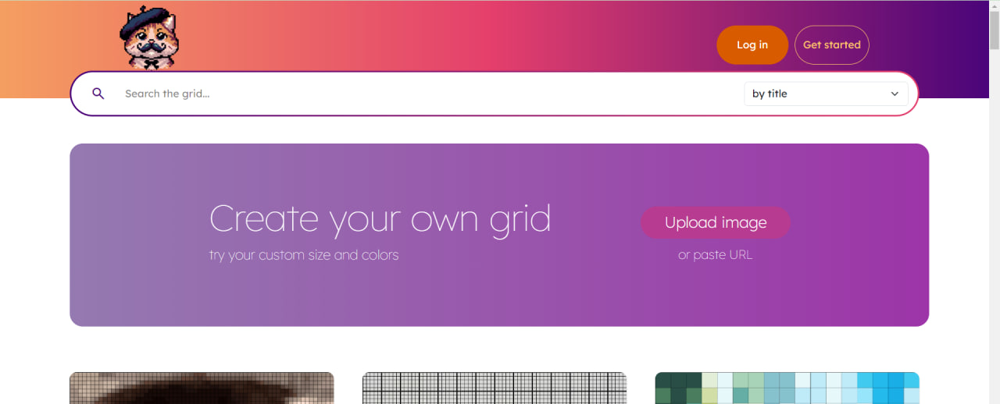
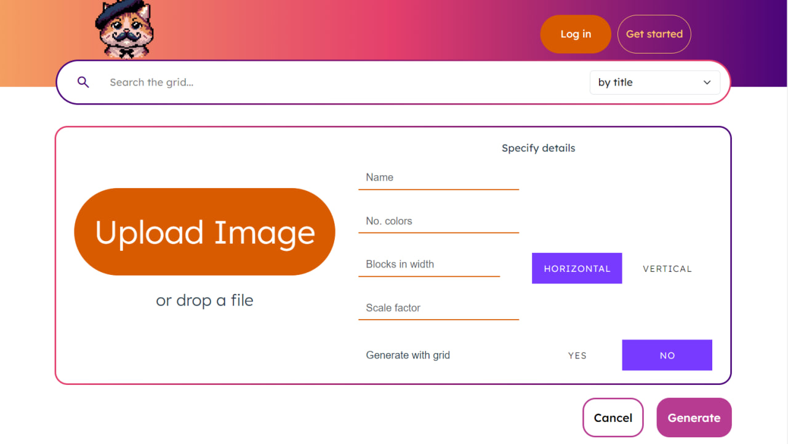
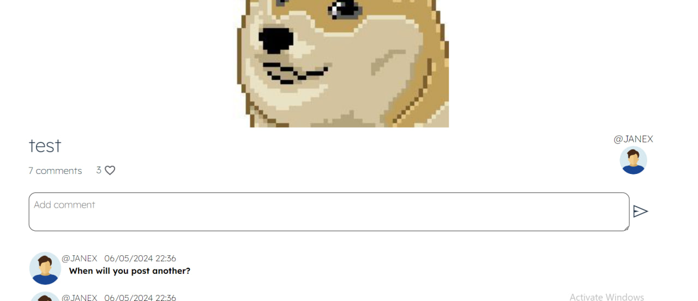
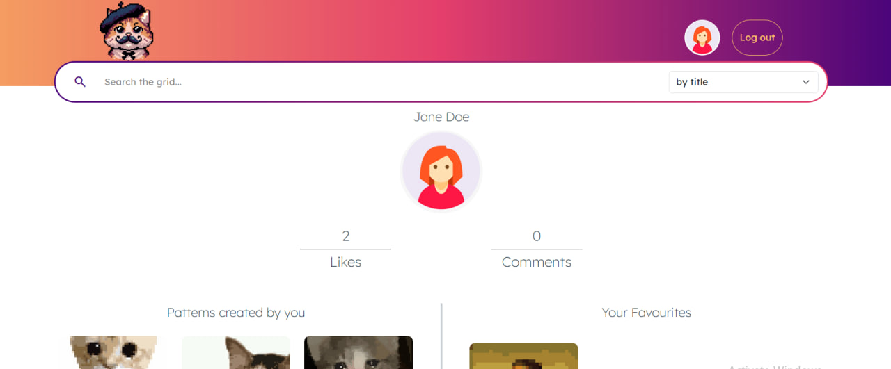
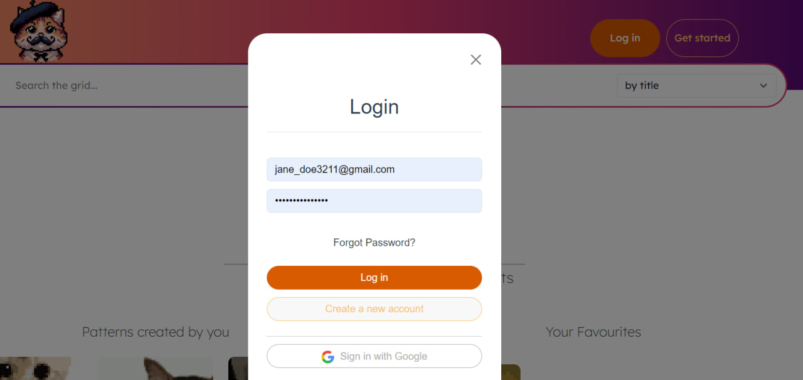

# Mr.Muster

# Image Pixelation Web Application

This project is an image pixelation web application developed as the final project for the Advanced Web Development course in Spring 2024. The application provides users with a platform to upload and pixelate images, interact with other users' posts, and manage their own content. The project showcases a comprehensive range of functionalities and technologies, emphasizing both front-end and back-end development skills.

## Application Features

- **User Authentication**: Users can create an account and log in to the application.
- **Image Pixelation**: Convert regular images into pixelated versions.
- **Content Management**: Save, download, and delete pixelated images.
- **User Interaction**: View, comment on, report, and like posts from other users.
- **Admin Capabilities**: Administrators can review reports and view application statistics.
- **Search Functionality**: Implemented a search feature to allow users to find specific posts or images.

## Technologies Used

- **Python**: Backend development using Flask.
- **Flask**: Web framework for building the application backend.
- **HTML/CSS**: Creating and styling static web pages.
- **JavaScript**: Adding interactivity to web pages.
- **Vue**: Front-end framework for building dynamic user interfaces, including routing pages.
- **Firebase**: Database for storing user data and images.
- **Cypress**: End-to-end testing framework to ensure application reliability.

## Responsibilities and Skills Gained

### Front-End Development

- **Static and Dynamic Pages**: Developed static pages using HTML and CSS, and enhanced them with dynamic functionality using JavaScript.
- **Vue Integration**: Utilized Vue.js for building responsive and dynamic user interfaces, including implementing routing for different pages.

### Backend and Database

- **Search Functionality**: Implemented robust search functionality to improve user experience.
- **Firebase Integration**: Worked extensively with Firebase to handle user authentication, data storage, and retrieval.

### Testing and Quality Assurance

- **Cypress Testing**: Conducted thorough end-to-end testing using Cypress to ensure the application operates smoothly and without errors.

### Project Management

- **Collaboration and Communication**: Worked as part of a team, communicating effectively to integrate different components of the application seamlessly.
- **Problem Solving**: Addressed and resolved various technical challenges throughout the development process, enhancing problem-solving skills.

## Screenshots

## Authors and acknowledgment
Wiktor Stasiak
Katarzyna Wysokińska
Do Danh Kha Mi
